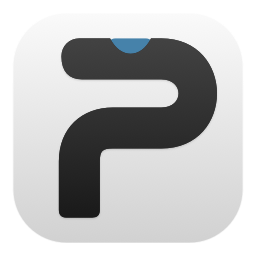

<p align="center">
  
</p>

<h1 align="center">Paul Notch</h1>

<p align="center"><strong>Your work, right at the notch.</strong></p>

<p align="center">
  A native, local-first macOS workspace for Codex usage, tasks, notes, clipboard history, focus, and lightweight controls.
</p>

## 这是什么

Paul Notch 是一款围绕 Mac 刘海设计的本地原生工作台。它把需要频繁查看、快速完成的事放在屏幕最上方：平时收成一条安静的状态岛，需要时再展开成工作区。

它不是又一个大而全的效率软件，而是一个快速回到当前工作的入口。

## 能做什么

- **Codex 状态**：显示当前可用的额度窗口、本机任务数和完成提醒。
- **任务与备忘**：快速创建任务，补充多行说明、分类、优先级、日期和子任务。
- **随笔记**：记录多行文本，保留草稿，支持分类、搜索和可恢复删除。
- **复制记录**：按类型显式开启，可暂停，默认不采集。
- **专注计时**：从首页直接开始或调整番茄钟。
- **音乐控制**：在用户授权后读取并控制 QQ 音乐的基本播放状态。
- **展示模式**：投屏时隐藏工作区，鼠标在原位置停留后才临时显示。
- **可调整工作区**：顶部功能和任务分类可拖动排序。

## 设计原则

- 本地优先，不内置遥测或广告。
- 剪贴板、录音和第三方服务都需要明确开启。
- 密钥保存在 macOS Keychain，不写入工作区文件。
- 状态不可靠时显示错误，不用伪造数据营造“已连接”。

## 当前状态

这是 **source-first 1.0**：源码、安全回归测试和本地打包脚本已公开，但暂无经 Apple Developer ID 签名和公证的通用下载包。

以下功能受本机环境限制：

- Codex 额度与任务状态来自本机可用数据，不是跨设备的官方实时仪表盘。
- QQ 音乐控制依赖 macOS 辅助功能/自动化权限和第三方播放器的界面结构。
- 录音转写需要用户自行配置服务；项目不会读取浏览器 Cookie。
- 链接可以本地保存和打开；公开 1.0 暂不自动联网读取网页标题或图标。
- 临时显示的刘海依然可能出现在屏幕共享中，展示模式不等于捕获排除。

## 开发

需要 macOS 13+ 和 Swift 6。

```bash
git clone https://github.com/wzy11p/Paul-Notch.git
cd Paul-Notch
swift build
zsh scripts/test-safety.sh
swift run PaulNotch
```

生成 `.app` 包：

```bash
# 仅用于本机试用；重新构建后系统权限可能需重新授予
zsh scripts/build-app.sh --adhoc

# 或使用你自己的稳定代码签名身份
zsh scripts/build-app.sh --identity "Apple Development: Your Name (TEAMID)"
```

输出位于 `dist/Paul Notch.app`。打包脚本不会自动安装、修改系统权限或迁移数据。

## 数据与权限

默认工作区位于：

```text
~/Library/Application Support/Paul Notch
```

首次使用摄像头、麦克风或音乐控制时，macOS 会要求相应权限。请只为你信任的构建授权。安全问题报告方式见 [SECURITY.md](SECURITY.md)。

## 来源与许可

Paul Notch 是基于 IslandMemo 继续开发的个人开源分支，并包含对 TO-DO Panel、CodexFloat 等 MIT 项目的适用改编。项目以 [MIT License](LICENSE) 开源；完整来源和版权说明见 [THIRD_PARTY_NOTICES.md](THIRD_PARTY_NOTICES.md)。

## Contributing

Issues and pull requests are welcome. Please read [CONTRIBUTING.md](CONTRIBUTING.md) before submitting changes.
